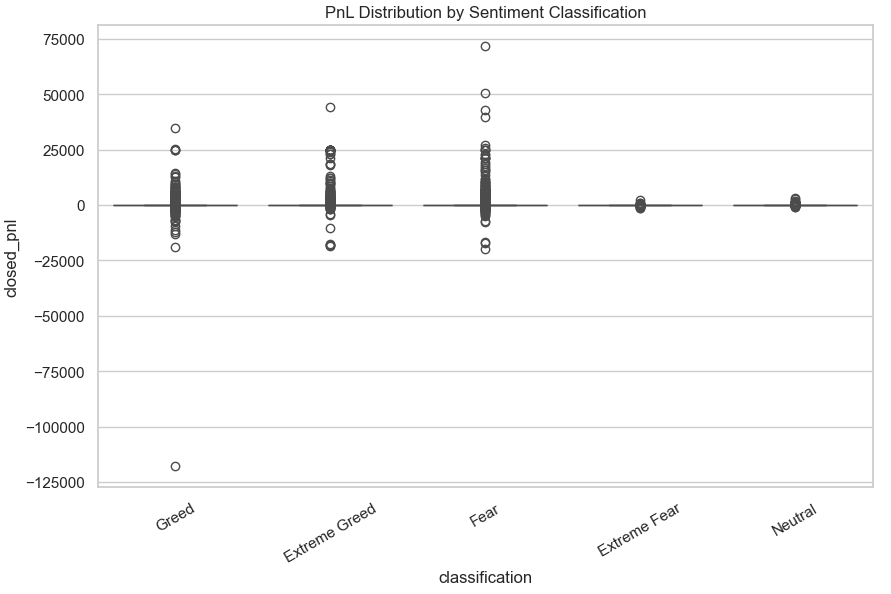
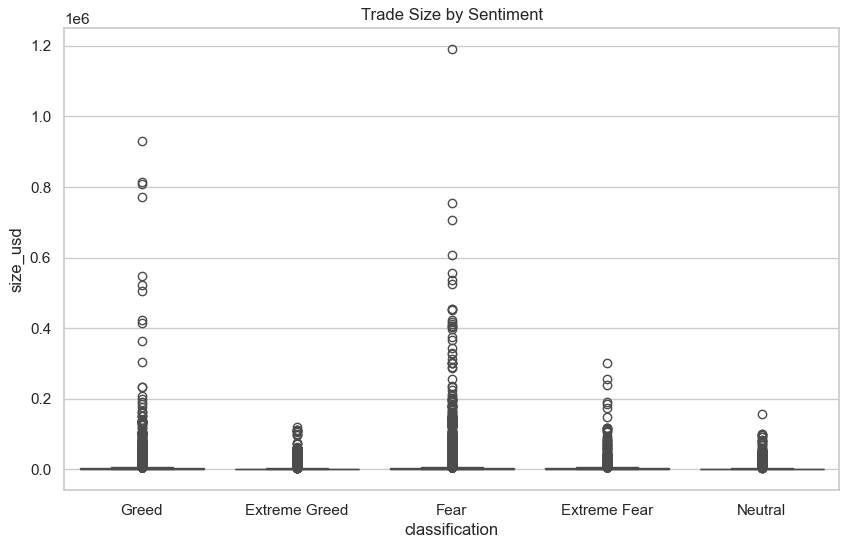
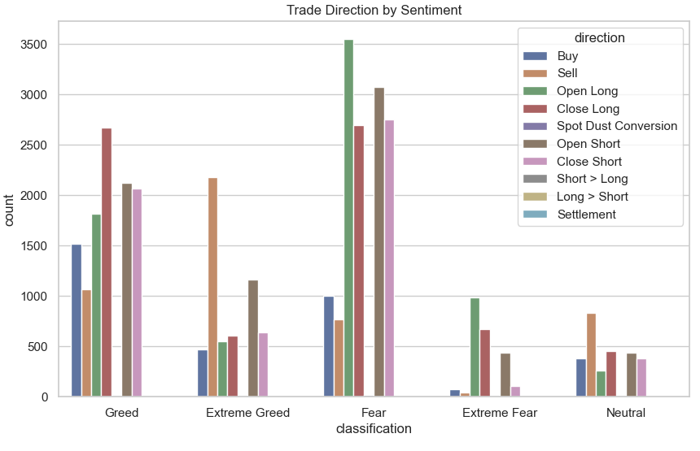
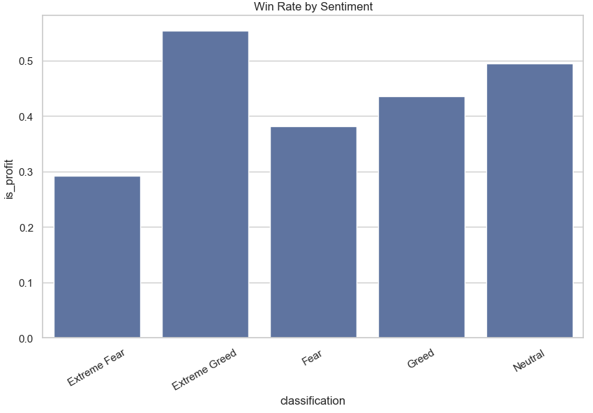
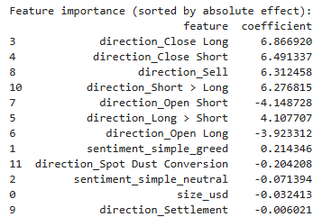

# Trader Performance vs Market Sentiment Analysis

## Project Overview
This project explores the relationship between market sentiment and trader performance using two primary datasets:  
1. **Bitcoin Market Sentiment Dataset** – contains daily market sentiment values labeled as Fear, Greed, or Neutral.  
2. **Historical Trader Data from Hyperliquid** – includes trade-level information such as account, coin, execution price, trade size, direction, PnL, and timestamp.  

The goal is to uncover patterns between sentiment and profitability and provide actionable insights for traders.

---

## 1. Exploratory Data Analysis (EDA)

The EDA forms the major part of this analysis and includes the following steps:

### **Data Preparation**
- Merged the sentiment and trader datasets on the `date` column.  
- Created a simplified sentiment column (`sentiment_simple`) with categories: Fear, Greed, Neutral.  
- Added a binary target column `is_profit` indicating whether a trade was profitable.

---

### **Distribution Analysis**
- Plotted histograms and KDEs of `closed_pnl` to visualize profit/loss distributions.  
- **Figure: PnL Distribution by Sentiment Classification**  
    
  *Shows how trade outcomes vary across Fear, Greed, and Neutral market conditions.*

---

### **Trade Characteristics**
- Analyzed trade size and direction relative to sentiment:  
  - **Figure: Trade Size by Sentiment**  
      
    *Indicates traders take larger positions during certain market sentiment phases.*  
  - **Figure: Trade Direction by Sentiment**  
      
    *Shows how sentiment influences long vs short trade choices.*

---

### **Win Rate Analysis**
- Calculated win rate per sentiment category and visualized:  
  - **Figure: Win Rate by Sentiment**  
      
    *Higher win rates are observed during Greed periods, while Fear reduces profitability.*

---

### **Statistical Testing**
- Conducted t-tests and Cohen’s d to compare PnL between Fear and Greed.  
- Findings: Extreme Fear significantly reduces profitability, while Extreme Greed slightly increases it.  

---

## 2. Predictive Analysis

To quantify the impact of sentiment and trade characteristics, a predictive model was built:

### **Model Setup**
- **Target:** `is_profit` (1 = profitable trade, 0 = loss)  
- **Features:** `sentiment_simple`, `size_usd`, `direction`  
- Categorical features were one-hot encoded.  
- Numeric features (trade size) were scaled for stability.

### **Model Training**
- Logistic Regression used due to interpretability and simplicity.  
- Train/test split: 70% training, 30% testing.  
- Model fitted using regularization to avoid overfitting.

### **Evaluation**
- **Classification Report:** Achieves 92% accuracy.  
- **ROC Curve:**  
    
  *Shows the model distinguishes profitable trades from losses effectively (ROC AUC = 0.946).*  
- **Feature Importance:**  
    
  *Indicates which factors (sentiment, trade size, direction) most influence profitability.*

---

## 3. Insights
- Market sentiment strongly affects trading outcomes.  
- Larger trades in Greed periods are more likely profitable, while Extreme Fear increases losses.  
- EDA provides a clear picture of patterns, and predictive modeling quantifies the impact for data-driven decision-making.

---

## 4. Libraries Used
- `pandas`, `numpy` – data manipulation  
- `matplotlib`, `seaborn` – visualization  
- `scipy.stats` – statistical tests  
- `sklearn` – predictive modeling and evaluation  

---

## 5. Future Work
- Include additional features such as coin type, time-of-day, or leverage (if available).  
- Explore ensemble models (Random Forest, XGBoost) for improved predictions.  
- Aggregate daily sentiment as a feature for multi-trade days to enhance model accuracy.
